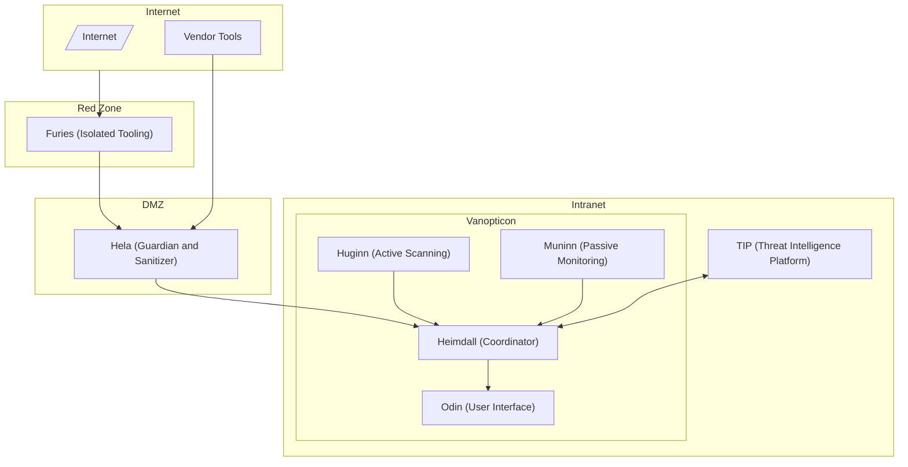

# Vanopticon Platform Architecture

## Overview

### Components

- **Heimdall** acts as the central coordinator, aggregating and orchestrating data flows from all platform components, TIP, DMZ, and external vendor tools.
- **Huginn** performs active scanning and sends results to Heimdall.
- **Muninn** provides passive monitoring and forwards data to Heimdall.
- **TIP (Threat Intelligence Platform)** used by Heimdall enhance data and intelligence.
- **Odin (User Interface)** is the main UI for users to interact with the platform and view orchestrated outputs.
- **Vendor Tools** represent third-party integrations feeding external data into the platform.

### Zones

- **Internet** is the external world, source of inbound traffic and data.
- **Red Zone** is an isolated environment for running legal-adjacent tooling, known as the Furies, which require strict control and separation.
- **DMZ** is a buffer and vetting layer, hosting Hela, who guards the platform from threats originating in the Red Zone and beyond.
- **Intranet** is the trusted internal environment where the Vanopticon platform operates.
